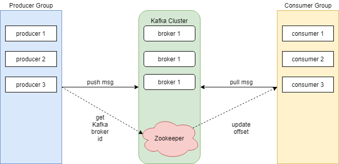

# Kafka

## Description

To develop Producer and Consumer application in Kafka data framework with Kafka Java API.

To get started with installing and configuring Kafka on local system and create a simple topic and write Java program for Producer and Consumer.

## Architecture



## Installation

Use Software Project Management and Comprehension Tool Maven [mvn](https://maven.apache.org/) to build the project.

## Usage

### Compile
```
mvn clean compile assembly:single.
```

### Consumer Execution
```
java -cp target/KafkaAPIClient-1.0-SNAPSHOT-jar-with-dependencies.jar com.spnotes.kafka.simple.Consumer [TOPIC_NAME] [GROUP_NAME]
```

### Producer Execution
```
java -cp target/KafkaAPIClient-1.0-SNAPSHOT-jar-with-dependencies.jar com.spnotes.kafka.simple.Producer [TOPIC_NAME]
```

## Contributing
Pull requests are welcome. For major changes, please open an issue first to discuss what you would like to change.

Please make sure to update tests as appropriate.

## License
[MIT](https://choosealicense.com/licenses/mit/)
